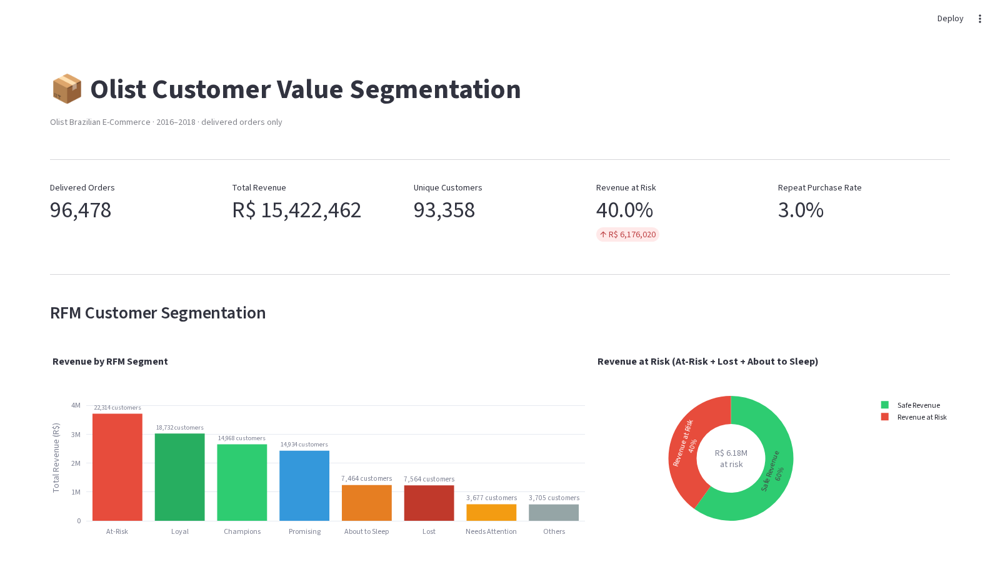

# Customer Value Segmentation & Revenue-at-Risk Analysis

An end-to-end SQL analytics project on the [Olist Brazilian E-Commerce dataset](https://www.kaggle.com/datasets/olistbr/brazilian-ecommerce) (~100K orders, 2016–2018). Demonstrates window functions, CTEs, RFM segmentation, cohort retention analysis, and revenue concentration — feeding a Power BI dashboard.

---

## Problem Statement

Olist is a Brazilian marketplace with a single-purchase-dominant customer base (~3% repeat rate). The goal is not to "fix churn" but to:

1. **Segment customers by value** (RFM) to identify Champions, Loyal, At-Risk, and Lost customers.
2. **Quantify revenue concentration** — how much revenue sits in segments at risk of leaving.
3. **Link delivery experience to review scores** — understanding the operational driver of customer dissatisfaction.

---

## Architecture (Medallion / 5-layer pipeline)

```
Source CSVs
    └── Layer 2: Raw/Staging tables       (01_schema_staging.sql)
            └── Layer 3: Cleaned views    (02_clean_conform.sql)
                    └── Layer 4: Analytical marts
                            ├── RFM segmentation         (03_rfm_segmentation.sql)
                            ├── Cohort retention         (04_cohort_retention.sql)
                            └── Revenue-at-risk          (05_revenue_at_risk.sql)
                                    └── Layer 5: Power BI dashboard (dashboard/)
```

**Key design decisions:**
- `customer_unique_id` (not `customer_id`) is used for all customer-level aggregation — Olist assigns a new `customer_id` per order, making every customer appear as a one-time buyer if the wrong key is used.
- Only `order_status = 'delivered'` orders count toward revenue and monetary metrics.
- The dashboard connects only to analytical views, never to raw staging tables.

---

## Repository Structure

```
customer-value-analysis/
├── README.md
├── load_data.py                  # Ingest CSVs into MySQL/PostgreSQL
├── requirements.txt
├── sql/
│   ├── 01_schema_staging.sql     # Staging tables, types, PKs/FKs, indexes
│   ├── 02_clean_conform.sql      # Cleaned views incl. fact_orders
│   ├── 03_rfm_segmentation.sql   # RFM scores and segments per customer
│   ├── 04_cohort_retention.sql   # Month-over-month cohort retention grid
│   └── 05_revenue_at_risk.sql    # Revenue by segment + delivery delay analysis
├── data/                         # Gitignored — place Olist CSVs here
├── dashboard/                    # customer_value.pbix (Power BI file)
└── images/                       # Dashboard screenshots
```

---

## Key Findings

| Metric | Value |
|---|---|
| Total delivered orders | 96,478 |
| Repeat purchase rate | ~3% |
| Champions segment — share of total revenue | 17.2% (R$2.65M) |
| At-Risk + Lost + About to Sleep — revenue at risk | **40.1%** (R$6.18M) |
| Late delivery rate for 1-star reviews | 36.8% of orders |
| Late delivery rate for 5-star reviews | 1.85% of orders |
| Avg. delivery delay for 1-star reviews | −4 days (early, but late when it is late) |
| Avg. delivery delay for 5-star reviews | −13 days (arrives well ahead of estimate) |

The clearest operational signal: orders that arrive late are **20× more likely** to receive a 1-star review than those arriving early.

---

## Tech Stack

| Layer | Tool |
|---|---|
| Database | MySQL 8+ (or PostgreSQL) |
| Data ingestion | Python 3, pandas |
| Analytics | SQL — window functions, CTEs |
| Dashboard | Power BI Desktop |

---

## How to Run

### 1. Get the data

Download the Olist dataset from Kaggle and place the 9 CSV files in `data/`:

```
customers, orders, order_items, order_payments, order_reviews,
products, sellers, geolocation, product_category_name_translation
```

### 2. Install Python dependencies

```bash
pip install -r requirements.txt
```

### 3. Create the database

```sql
CREATE DATABASE olist;
```

### 4. Load the data

```bash
python load_data.py --host localhost --db olist --user <user> --password <password>
```

### 5. Run the SQL pipeline (in order)

```bash
mysql -u <user> -p olist < sql/01_schema_staging.sql
mysql -u <user> -p olist < sql/02_clean_conform.sql
mysql -u <user> -p olist < sql/03_rfm_segmentation.sql
mysql -u <user> -p olist < sql/04_cohort_retention.sql
mysql -u <user> -p olist < sql/05_revenue_at_risk.sql
```

### 6. Open the dashboard

Open `dashboard/customer_value.pbix` in Power BI Desktop and update the data source connection to your local MySQL instance.

---

## Dashboard Preview


